# Beacon

A self-hostable, multi-tenant link shortener. Staff sign in, create and manage short links,
organise them into workspaces and folders, and view click analytics. Short links redirect from
the origin root: `https://<host>/{code}`.

Beacon is vendor-neutral. Identity is pluggable (Microsoft Entra ID
first; see [Auth](#auth)).

## Screenshots

Manage, organise, and measure short links from the admin SPA — workspaces in the left rail, and the
current workspace's folders + analytics in the sidebar. (Default **Beacon** branding, running locally
against demo data.)

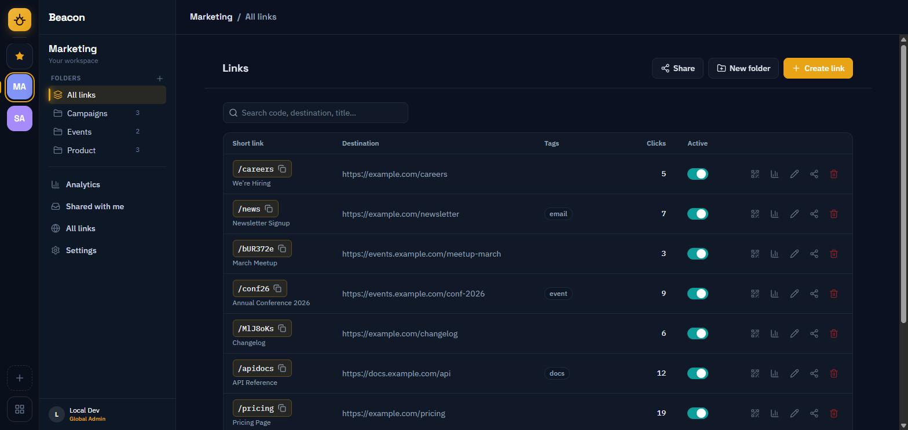

| | |
|---|---|
| **Create a link** — live short-URL preview, folder pre-selected | **Organise with folders** |
| 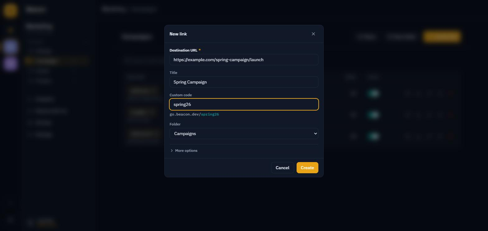 | 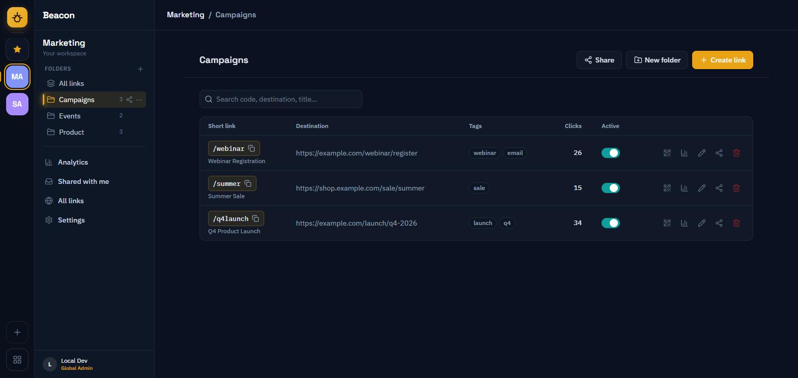 |
| **Per-link analytics** — referrers, browser, OS, device, country | **Workspace analytics** — clicks over time + top links |
| 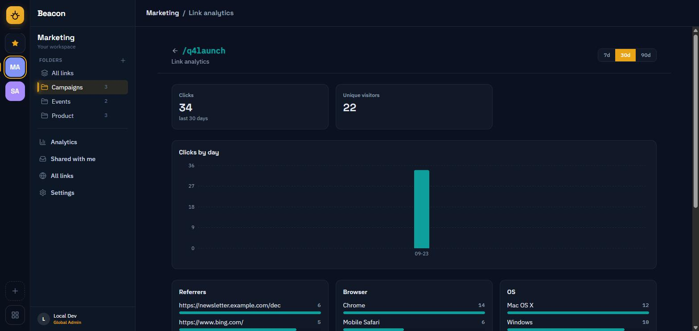 | 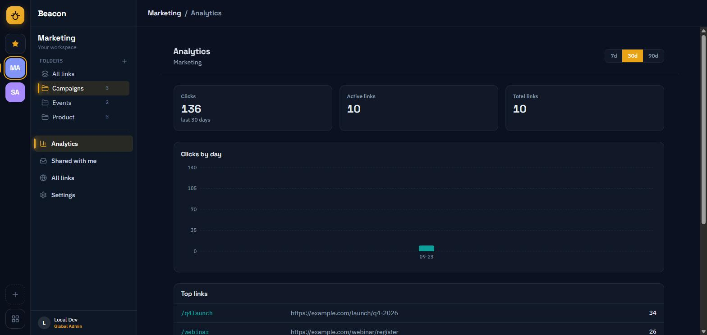 |
| **Sharing & access** — per-resource, Viewer / Editor / Manager | **QR codes** — generated client-side, download as PNG |
| 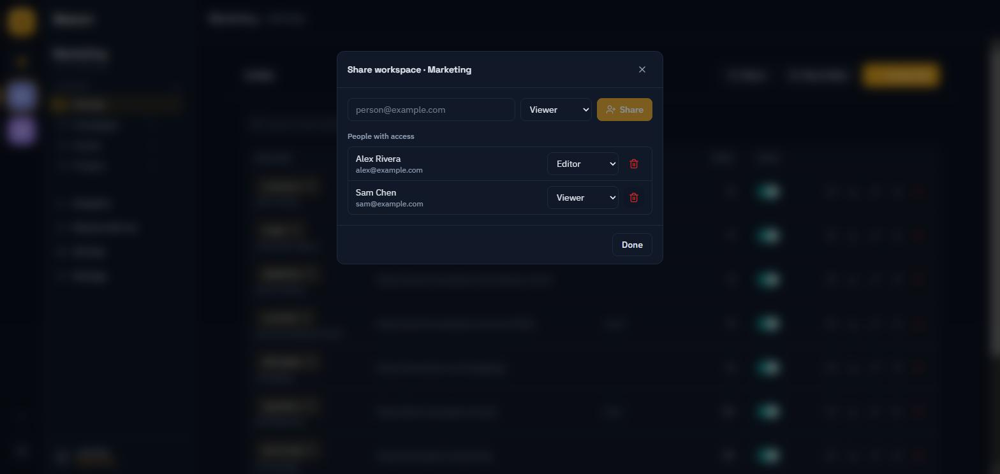 | 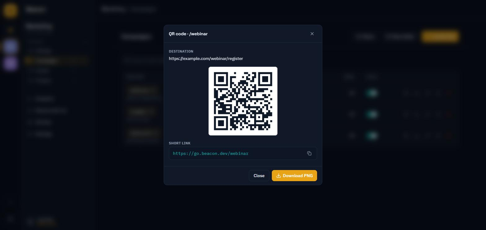 |
| **Global Admin: every link** — across all workspaces, with owner | **Global Admin: browse all workspaces** — by owner |
| 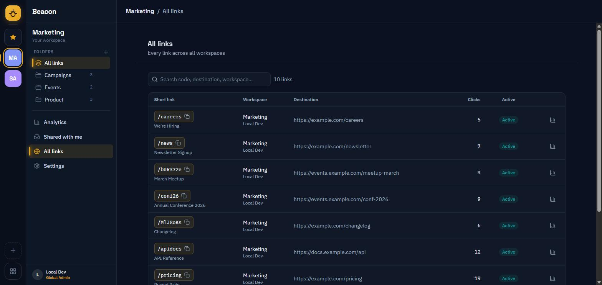 | 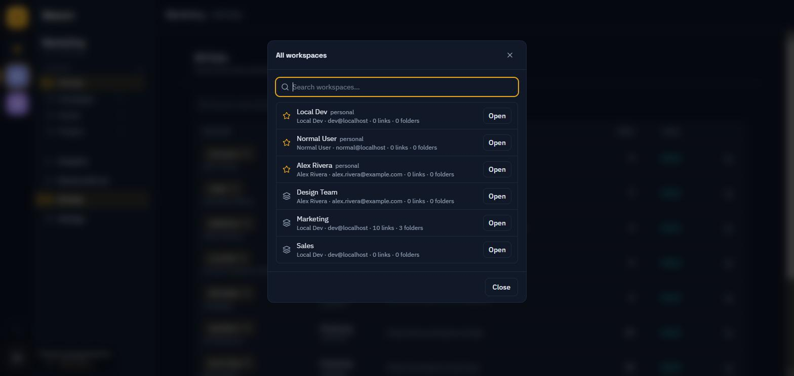 |
| **Branding** — name, colour, logo, live 404 preview | **Branded landing page** — served for an unknown/expired code |
| 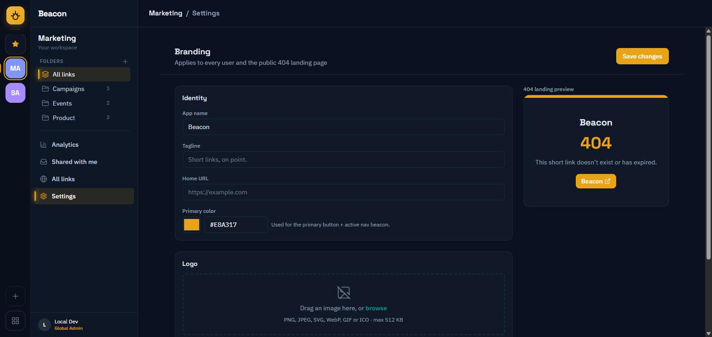 | 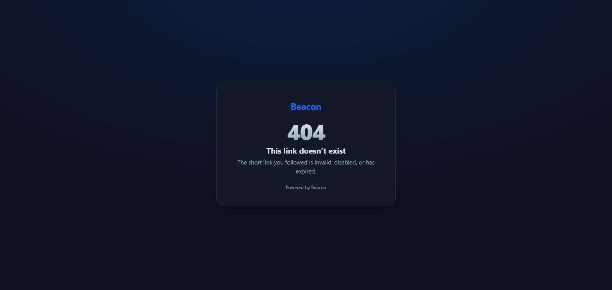 |

## Architecture

Single-project vertical-slice .NET API + a React admin SPA, orchestrated for local dev by .NET
Aspire.

- **.NET 10 minimal API** (`src/Beacon.Api`) — one project, feature slices under
  `Features/`, shared plumbing under `Common/` and `Infrastructure/`.
- **PostgreSQL** (EF Core, snake_case) — links, workspaces, folders, shares, clicks.
- **Redis + FusionCache (HybridCache)** — L1 memory + L2 Redis + backplane for the redirect
  hot-path, with negative caching and invalidate-on-write.
- **React + Vite + TypeScript SPA** (`frontend/admin-app`) — admin link management + analytics.
- **Aspire AppHost** (`src/Beacon.AppHost`) — runs Postgres + Redis + the API for local dev.

### Domain

`Workspace` → `Folder` (organisation only) → `Link` (`code` + destination + metadata). Access is
**per-resource**: whoever creates a Workspace, Folder, or Link is its **Owner** and can **Share** it
with others as **Viewer / Editor / Manager**, inheriting down the hierarchy (a share on a Folder
covers its Links). Two system roles only — **Global Admin** and **User**. See
[`CONTEXT.md`](./CONTEXT.md) for the glossary and [`docs/adr/`](./docs/adr) for key decisions
(the sharing model is [ADR-0003](./docs/adr/0003-resource-sharing-authorization.md)).

### Routing (single origin)

`/{code}` → 302 redirect (public) · `/api/*` → management API (authenticated) · `/admin` → the SPA.
Reserved prefixes (`api`, `admin`, `health`, …) can never be generated as a code — see
[ADR-0001](./docs/adr/0001-single-origin-root-is-redirect.md).

## Local development

Prerequisites: .NET 10 SDK, Node 24, Docker Desktop.

```bash
# Terminal 1 — API + Postgres + Redis via Aspire (API pinned to http://localhost:34110)
dotnet run --project src/Beacon.AppHost

# Terminal 2 — the admin SPA (Vite on http://localhost:34100, proxying /api to 34110)
cd frontend/admin-app && npm install && npm run dev
```

Open the SPA at `http://localhost:34100`. With no identity provider configured, the **Dev auth
provider** signs every request in as a local user, so there is no login step.

## Configuration

Connection strings are injected by Aspire in dev and by the compose stack in the container. Key
settings (`appsettings.json` / environment):

| Setting | Purpose |
|---|---|
| `ShortUrl:BaseUrl` | Origin used to render short URLs (e.g. `https://beacon.example.com`). |
| `Cors:Origins` | Extra allowed SPA origins (dev allows any localhost). |
| `Auth:Providers` | Enabled identity providers (e.g. `["Entra"]`). Empty ⇒ inferred. |
| `Auth:GlobalAdmins` | Global-admin rules: `Oids`, `Emails`, `Groups`, `Claims`. |
| `AzureAd:*` | Entra app registration (`TenantId`, `ClientId`, `Audience`). |

## Auth

Authentication is an abstraction (`IAuthProvider`) — see
[ADR-0002](./docs/adr/0002-pluggable-auth-providers.md).

- **Providers**: `Dev` (POC, auto-authenticates), `Entra` (Microsoft Entra ID bearer). Add another
  IdP by adding one `IAuthProvider`.
- **Enable Entra**: set `AzureAd:TenantId` + `AzureAd:ClientId` (+ `Audience`). The default provider
  then flips to Entra automatically; the Dev provider drops out.
- **Global Admin** is provider-agnostic: match by object id, email, a security-group id in a `groups`
  claim, or any claim `type == value` (`Auth:GlobalAdmins`).

### Entra app registration ("Beacon")

A single-tenant app registration is provisioned (name **Beacon**), with an API scope
(`access_as_user`, v2 tokens), SPA + Web redirect URIs, security-group claims, and Graph `User.Read`.

| Value | |
|---|---|
| Tenant ID | `11111111-1111-1111-1111-111111111111` |
| Client ID | `22222222-2222-2222-2222-222222222222` |
| Application ID URI / Audience | `api://22222222-2222-2222-2222-222222222222` |
| Redirect (SPA) | `https://beacon.example.com/admin`, `http://localhost:34100` |
| Redirect (Web/BFF) | `https://beacon.example.com/signin-oidc` |

**Admin consent is required** before Entra will work: an Entra admin grants it in the portal
(Enterprise applications → Beacon → Permissions → *Grant admin consent*) or via
`az ad app permission admin-consent --id 22222222-2222-2222-2222-222222222222`.

**Cutover** (once consent is granted) — set these in the stack env, then redeploy:

```
AzureAd__Instance=https://login.microsoftonline.com/
AzureAd__TenantId=11111111-1111-1111-1111-111111111111
AzureAd__ClientId=22222222-2222-2222-2222-222222222222
AzureAd__Audience=api://22222222-2222-2222-2222-222222222222
Auth__GlobalAdmins__Emails__0=<your-work-email>   # or __Groups__0=<security-group-object-id>
```

**How it fits together:** set `AzureAd__*` and the backend validates **bearer** tokens; the SPA uses
**MSAL** (`@azure/msal-browser` + `@azure/msal-react`, gated on `VITE_ENTRA_CLIENT_ID`) to sign in
and attach the token. The SPA redirect URI is `${origin}/admin`. Global Admins are matched by email
(`Auth__GlobalAdmins__Emails__0`). Remove the `AzureAd__*` env to fall back to Dev auth. A BFF cookie
flow is a possible future hardening path.

## Branding & the not-found page

Instead of a raw 404, an unknown/disabled/expired code (and any other unmatched non-API path) serves
a **branded landing page**. A single global `Branding` record — app name, tagline, logo, primary
colour, home URL — drives both that page and the admin shell. A Global Admin edits it in the SPA
(Settings → Branding), including uploading a logo. Endpoints: public `GET /branding` +
`GET /branding/logo`; Global Admin `PUT /api/v1/branding`, `POST|DELETE /api/v1/branding/logo`.

## Deploy

The repo ships a self-contained [`docker-compose.yml`](./docker-compose.yml): Postgres + Redis +
API + admin SPA behind a small single-origin reverse proxy. Build and run the whole stack with:

```bash
docker compose up --build
```

Then open `http://localhost:8080/admin` (the SPA); short links resolve at `http://localhost:8080/{code}`.

Configuration (compose env, all optional):

| Var | Purpose |
|---|---|
| `SHORT_URL_BASE` | Public origin your short URLs render on (default `http://localhost:8080`). |
| `DB_PASSWORD` | Postgres password (default `postgres` — change it for anything real). |
| `AzureAd__*` / `VITE_ENTRA_*` | Set these to require Microsoft Entra sign-in (see [Auth](#auth)). |

For production, terminate TLS at your own reverse proxy / CDN in front of the stack, and point a
domain (or a CNAME) at it — the app itself only needs a single origin.

> **Security note:** with no Entra configuration the API runs the built-in **Dev auth provider**,
> which authenticates every request as a local user — so the admin surface is **open** to anyone who
> can reach it. Set the `AzureAd__*` / `VITE_ENTRA_*` values before exposing it beyond localhost.

## Tests

Unit, integration and architecture tests live under `tests/`. Integration tests start a real
Postgres with Testcontainers, so Docker must be running.

```bash
dotnet test --solution beacon.slnx
```

## License

[O'Saasy License](./LICENSE). You can use, modify and self-host Beacon freely. You cannot offer it to others as a competing hosted service.
